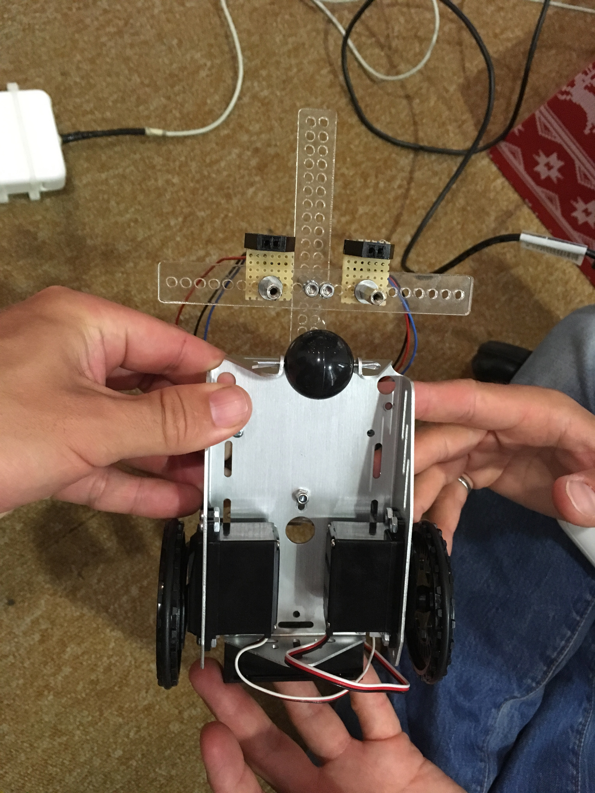
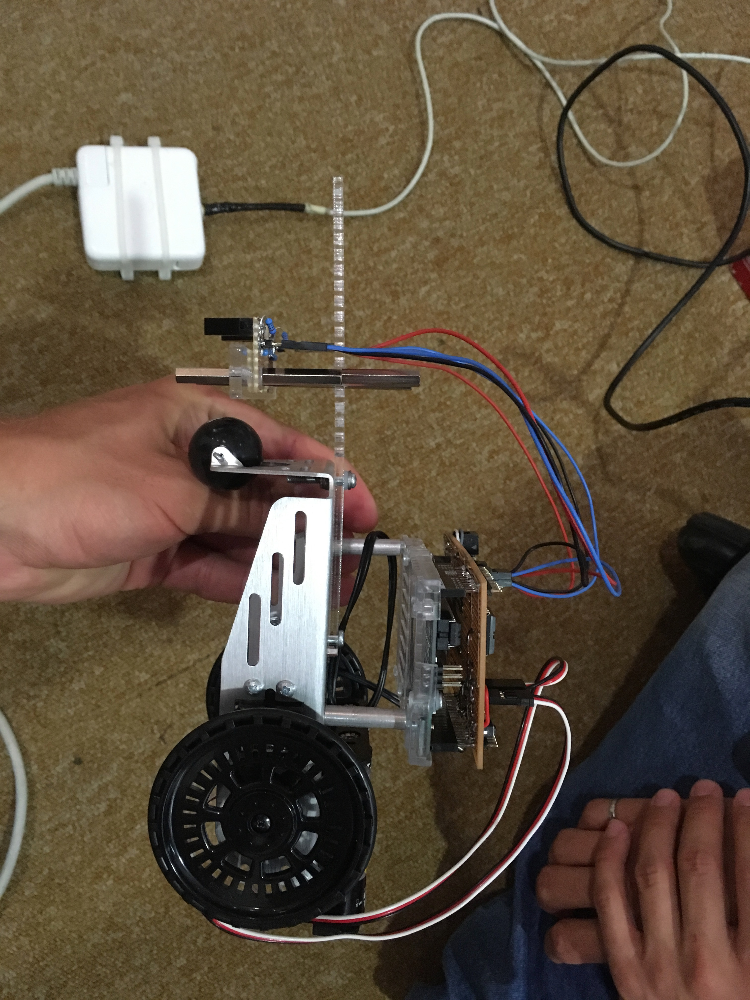
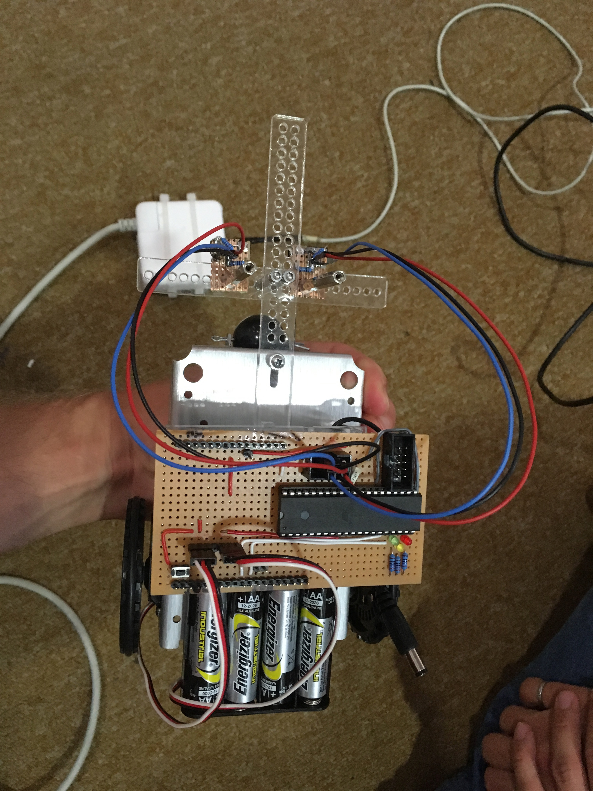
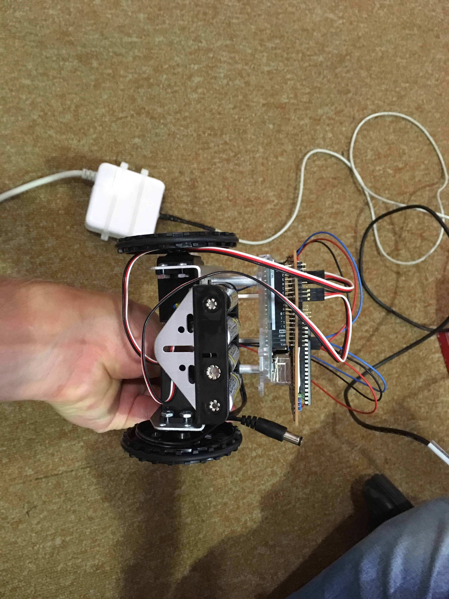
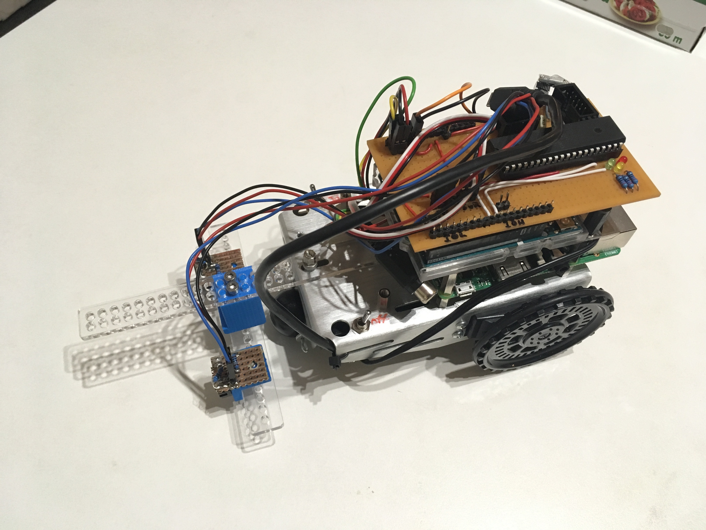
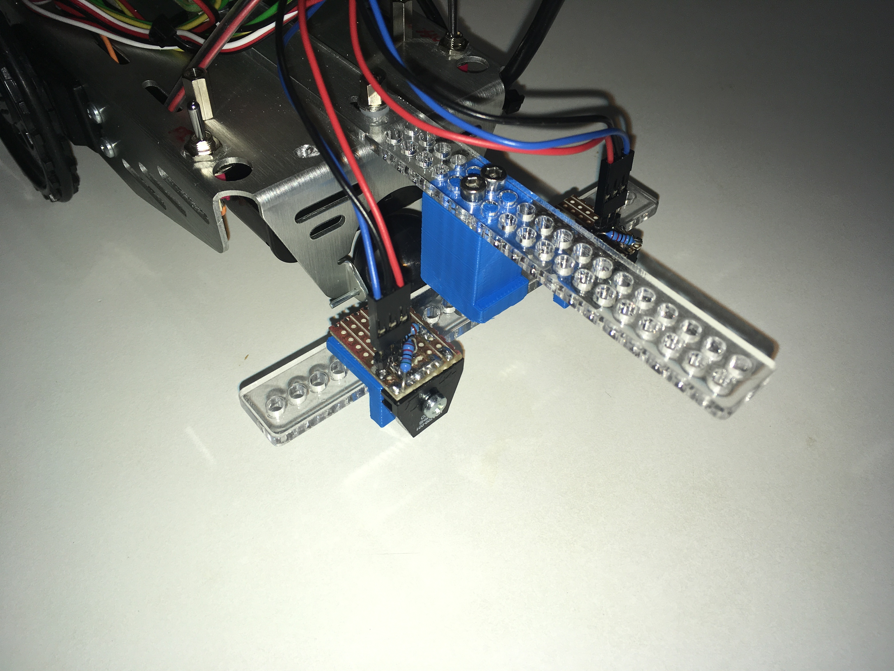
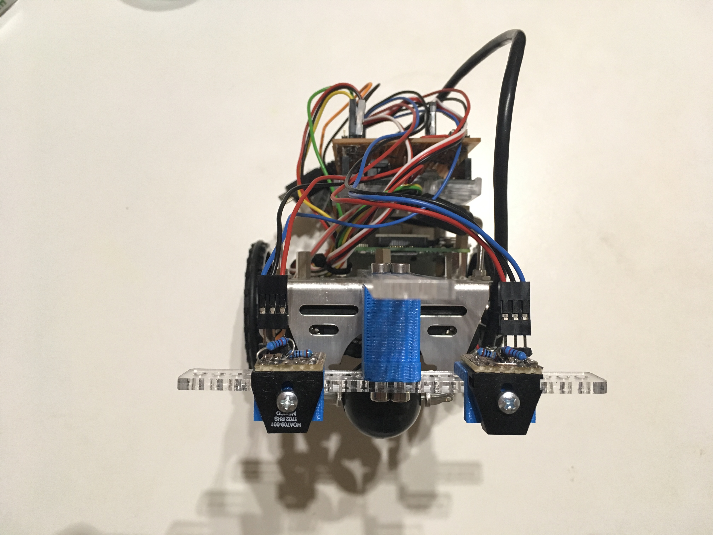
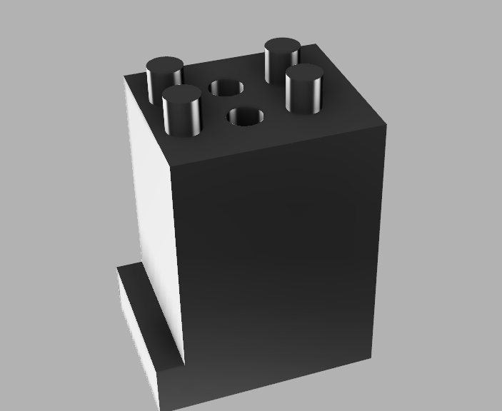
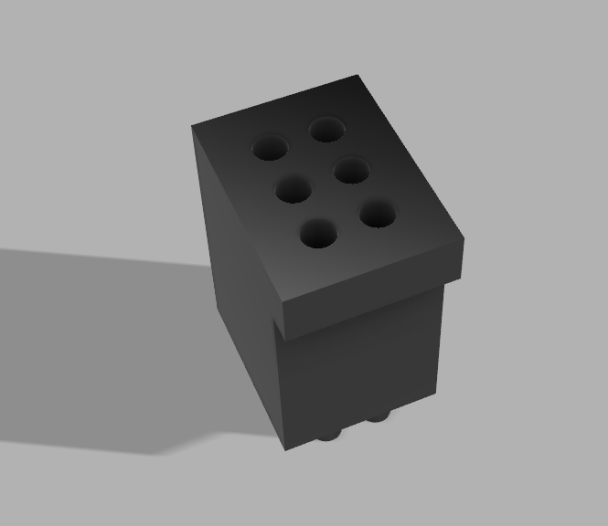
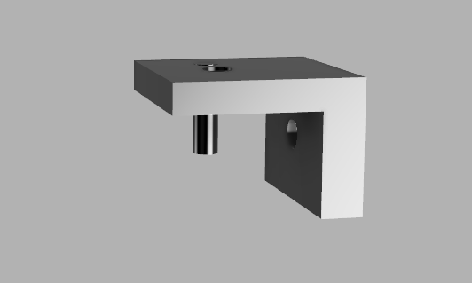

# Robot Dimentions

-  Forward speed:  31 mm/s
-  Backward speed:  15.5 mm/s
-  Body length:  130 mm
-  Center to wheel axis:  40 mm
-  Center to first fore-aft sensor position:  96 mm
-  wheel axis width:  106 mm
-  wheel axis to first fore-aft sensor position:  136 mm, increasing by 5 mm increments
-  sensors at widest separation:  108 mm
-  sensors at narrowest separation:  38 mm
   -  each sensor can be offset laterally by 5 mm
-  height of sensors from map:  9.44 mm
-  weight:  436 g
-  Wheel radius:  33 mm

## Design

DSE bars are with 3Ø and spaced every 5mm

### Initial design

### Improved Design for stability of the sensor mounts

