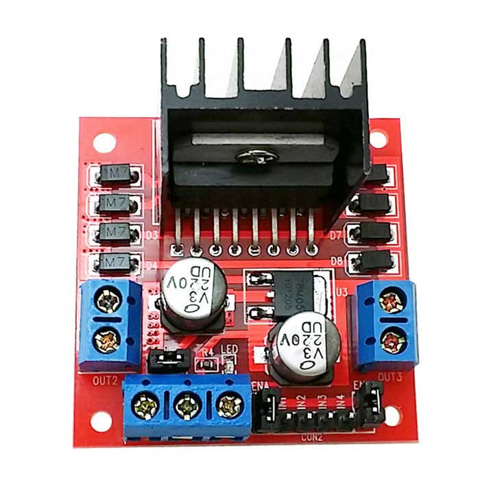
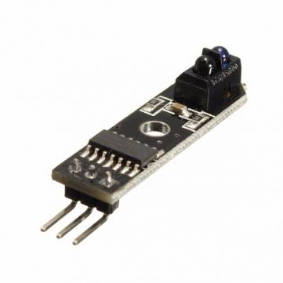

# Robot Platform

The Robot platform is using the Arduino Mega 2560 controller board [link](https://www.ebay.com/itm/MEGA-2560-R3-ATMEGA16U2-ATMEGA2560-16AU-Board-Free-USB-Cable-For-Arduino/272386431938?hash=item3f6b7f1bc2:g:cycAAOSwLF1X4~Zt:rk:3:pf:0) and a standard cheap eBay 2WD line following robot platform.

## Hardware

* High Quality Plastic Battery Holder Storage Box Case for 18650 With Wire Lead 8 kr [Link](https://www.ebay.com/itm/High-Quality-Plastic-Battery-Holder-Storage-Box-Case-for-18650-With-Wire-Lead-FR/122357752996?hash=item1c7d1724a4:g:JK8AAOSw4A5YpR0Z:rk:2:pf:0)

* L298N Dual H Bridge DC Stepper Motor Drive Controller Board Module For Arduino - 21 kr [Link](https://www.ebay.com/itm/Stepper-Motor-Drive-Controller-Board-Module-L298N-Dual-H-Bridge-DC-For-Arduino/170926726867?epid=1141772933&hash=item27cc06ded3:g:s4wAAOSwXeJXe31g:rk:1:pf:0)

* New Smart Motor Robot Car Battery Box Chassis Kit Speed Encoder For Arduino 52 kr [Link](https://www.ebay.com/itm/2WD-New-Motor-Smart-Robot-Car-Chassis-Kit-Speed-Encoder-Battery-Box-For-Arduino/282778413895?hash=item41d6e82b47:g:mkIAAOSwk1haKS3X:rk:1:pf:0)

* 3 Series BMS PCB Placa de Protección para Batería de Litio 18650 33 kr [Link](https://www.ebay.com/itm/Proteccion-cargador-placa-PCB-BMS-Modulo-Para-18650-Pila-Litio-Bateria/263595449713?hash=item3d5f835d71:m:mFyWpbIf34v8YofUjUjuEaQ:rk:1:pf:0) CHOOSE: 3S 12V 10A

* 3 Panasonic NCR18650GA 3,6V / 3450mAh - Max 10A 150 kr [link](https://www.ebay.com/itm/4X-3450mAh-10A-GENUINE-SANYO-PANASONIC-NCR18650GA-Tested-Cells-18650/173615458719?hash=item286c49a99f:m:meh9BLsrThH0GlbX65FeLTA:rk:1:pf:0)

* (optional) 5PCS Slot Type IR Optocoupler Speed Sensor Module LM393 for Arduino 14 kr [link](https://www.ebay.com/itm/5PCS-Slot-Type-IR-Optocoupler-Speed-Sensor-Module-LM393-for-Arduino/132478779559?hash=item1ed859c0a7:g:disAAOSw0lVbCTU0:rk:1:pf:0)

* 5PCS IR Infrared Line Track Follower Sensor TCRT5000 Obstacle Avoidanc 12 kr [link](https://www.ebay.com/itm/5PCS-TCRT5000-IR-Infrared-Line-Track-Follower-Sensor-Obstacle-Avoidanc-Module/311568146310?epid=911730611&hash=item488ae89f86:g:TDUAAOSwlzZbIiiI:rk:1:pf:0)

* (optional) 2PCS Obstacle Avoidance TCRT5000 Infrared Track Sensor Module For Arduino 7 kr [link](https://www.ebay.com/itm/2-5-10PCS-Obstacle-Avoidance-TCRT5000-Infrared-Track-Sensor-Module-For-Arduino/401397862776?hash=item5d752d5178:m:m6xu1VawCBR2mbT-hgp2_Gw:rk:1:pf:0) CHOOSE 2pcs

* 3d printed parts

* cables

* Arduino MEGA Sensor Shield. [Gerber files](PCB/gerber.zip)

### Sensor Front Mount

The mount should be 20 mm high i.e. the distance from under the robot frame to where the sensors are screwed into the mount.

[Sensor Mount STL](LF_sensor_holder.stl)

## Controller wiring

## Assembled robot 

